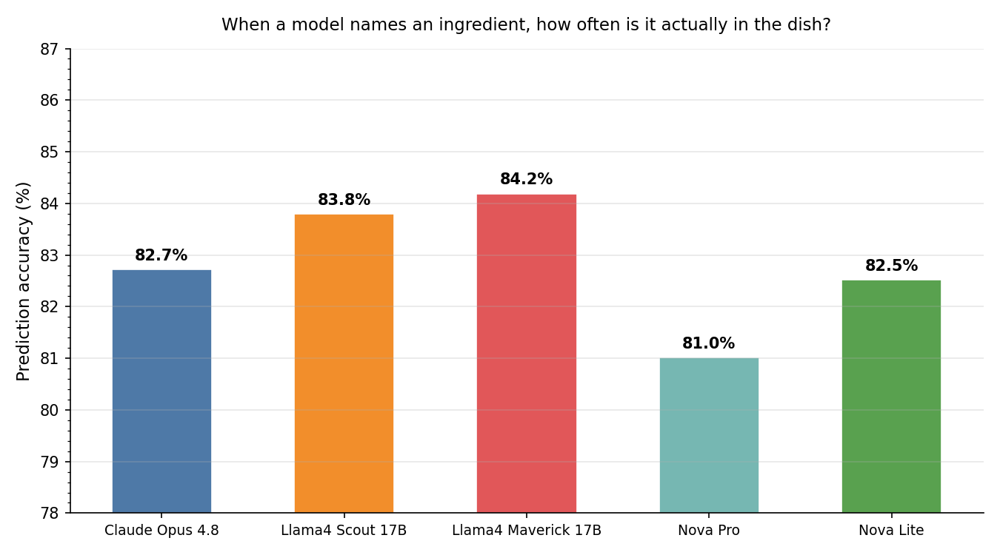
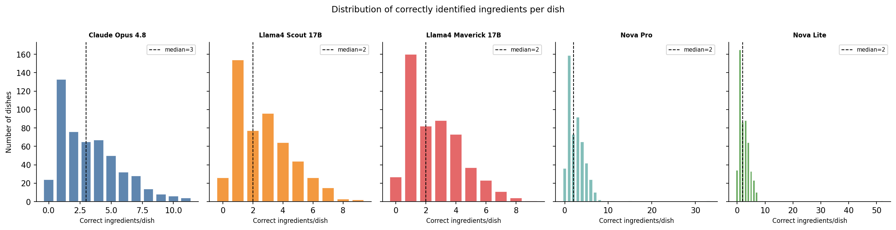
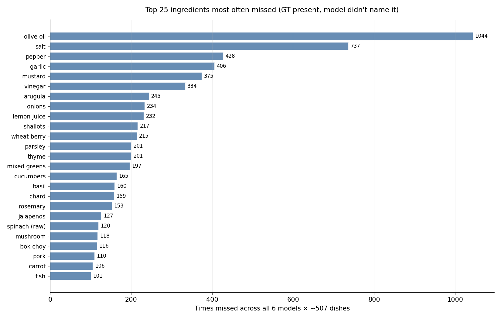
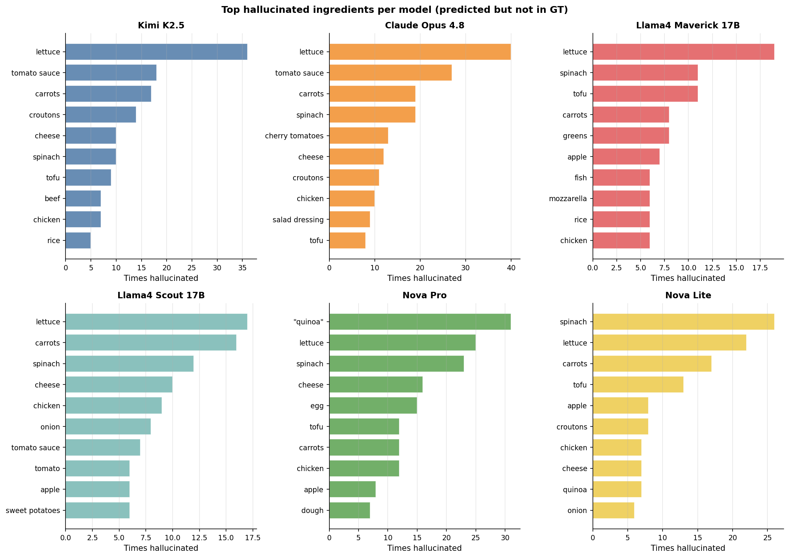
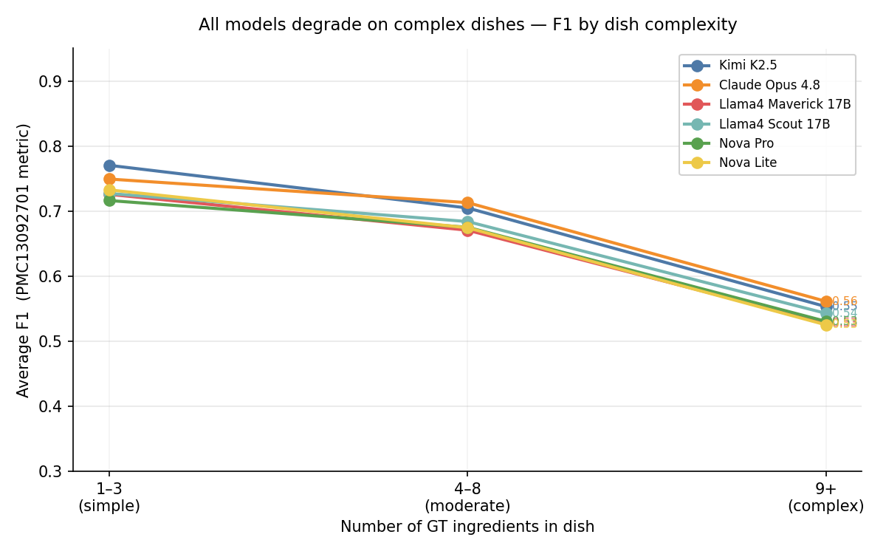
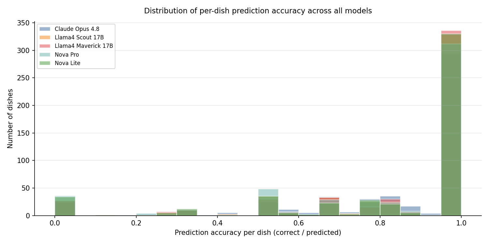

# VLM Food Recognition Evaluation on Nutrition5k

Reproducible evaluation harness for photo-based food ingredient recognition using vision-language models (VLMs), benchmarked against the [Nutrition5k](https://github.com/google-research-datasets/Nutrition5k) dataset using the custom metric from [PMC13092701](https://pmc.ncbi.nlm.nih.gov/articles/PMC13092701/).

---

## Results

Full 507-dish evaluation on the Nutrition5k overhead test split — **10 vision models** across two run sessions. All models use the same prompt, same test images, same metric. Claude Opus 4.8 was run via the Anthropic API; the other nine via AWS Bedrock (`us-east-2`).

### Prediction Accuracy

**Prediction accuracy** = fraction of named ingredients that were actually in the dish. It's the fairest primary metric here, because you cannot see invisible ingredients (olive oil, salt, pepper) in a photo and recall punishes a model for not naming them. Rows sorted by prediction accuracy; all values computed at match threshold `sim ≥ 0.4` by [eval/prediction_metrics.py](eval/prediction_metrics.py) / [eval/plot_analysis.py](eval/plot_analysis.py).

| Model | Provider | F1 | Precision | Pred Accuracy | Correct/Dish (mean/median) | Avg Predictions | Zero-Correct | All-Correct |
|---|---|---|---|---|---|---|---|---|
| **Kimi K2.5** | Moonshot | **0.682** | **0.733** | **85.1%** | 3.0 / 2 | 3.6 | **4.5%** | 65.8% |
| Llama4 Maverick 17B | Meta | 0.646 | 0.703 | 84.2% | 2.6 / 2 | 3.1 | 5.3% | **66.4%** |
| Llama4 Scout 17B | Meta | 0.655 | 0.711 | 83.8% | 2.7 / 2 | 3.2 | 5.1% | 64.7% |
| Qwen3-VL 235B | Alibaba | 0.667 | 0.723 | 83.7% | 2.7 / 2 | 3.3 | 5.1% | 63.6% |
| Claude Opus 4.8 | Anthropic | 0.677 | 0.714 | 82.7% | 3.3 / 3 | 4.1 | 4.7% | 58.0% |
| Nova Lite | Amazon | 0.649 | 0.712 | 82.5% | 2.6 / 2 | 3.1 | 6.7% | 65.2% |
| Nova Pro | Amazon | 0.644 | 0.700 | 81.0% | 2.7 / 2 | 3.3 | 7.1% | 61.5% |
| Sonnet 4.6 | Anthropic | 0.649 | 0.673 | 79.0% | **3.6 / 3** | 4.6 | 5.5% | 51.8% |
| Nova 2 Lite | Amazon | 0.614 | 0.666 | 76.8% | 2.6 / 2 | 3.2 | 10.9% | 57.5% |
| Haiku 4.5 | Anthropic | 0.580 | 0.611 | 72.0% | 2.9 / 2 | 3.9 | 11.3% | 45.7% |

- **Pred Accuracy** — per-dish (correct ÷ predicted), averaged over dishes.
- **Zero-Correct** — % of dishes where the model got nothing right.
- **All-Correct** — % of dishes where *every* ingredient the model named was real.

### Key findings

**Kimi K2.5 leads, and the disciplined models win generally.** Kimi tops F1 (0.682), precision (0.733), and prediction accuracy (85.1%) while naming only 3.6 ingredients per dish. The next tier — Maverick, Scout, Qwen3-VL — all sit at 83–84% accuracy with ~3 predictions/dish. High accuracy comes from naming what you can actually see, not from guessing more.

**Verbosity inflates F1 but not accuracy — clearest in Sonnet 4.6 and Claude Opus.** Sonnet names the most ingredients (4.6/dish), so it has the highest *absolute* correct count (3.6/dish) — yet its *rate* of being right is only 79.0%. Claude Opus shows the same pattern (4.1 predictions, 82.7% accuracy). When you ask "for each thing the model named, was it actually there?", the chatty models drop below the disciplined ones.

**The small models are the least reliable.** Haiku 4.5 (72.0%) and Nova 2 Lite (76.8%) have the lowest accuracy *and* the highest zero-detection (11.3% / 10.9%) — nothing right on ~1 dish in 9, versus ~1 in 20 for the leaders.

**Third-party models (Kimi, Maverick, Scout, Qwen) beat every Anthropic/Amazon option on prediction accuracy.**

**Cost comparison (per 507 dishes, approx):**
- Claude Opus 4.8 / Sonnet 4.6 (vision): ~\$0.80–1.20
- Kimi K2.5, Qwen3-VL, Llama4 Maverick/Scout (Bedrock): ~\$0.02–0.08
- Nova Lite / Nova 2 Lite (Bedrock): ~\$0.003–0.01

At 10–40× cheaper with *higher* prediction accuracy, the open/third-party Bedrock models are the practical choices for this task.

> **All-Correct definition:** % of dishes where every ingredient the model named was real (`sim ≥ 0.4`), computed uniformly across all 10 rows. An earlier README revision computed this one column differently for the first five models; it has been recomputed consistently. F1, precision, accuracy, correct/dish, and zero-correct are unchanged from prior runs.

---

## Recall understates visual performance on this dataset

**Recall is the wrong yardstick here.** We implement the PMC13092701 paper's recall metric faithfully, but on Nutrition5k it penalizes models for failing to name ingredients that are physically impossible to see — so a perfect visual reading still scores poorly.

Nutrition5k's ground truth includes ingredients that are **physically invisible in overhead photos**:

| Category | Top examples | Why a model can't see them |
|---|---|---|
| Oils / fats | olive oil, butter | Absorbed into food, no visual presence |
| Dissolved seasonings | salt, pepper | Dissolved or tiny specks below image resolution |
| Aromatics cooked in | garlic, shallots, onions | Minced/diced and hidden inside other foods |
| Acid/liquid components | vinegar, lemon juice | Clear liquids poured on and invisible |

The top missed ingredients across all 10 models confirm this — the leaderboard of "misses" is dominated by invisible ingredients:

| Ingredient | Times missed (across 10 models × 507 dishes) |
|---|---|
| olive oil | 1646 |
| salt | 1213 |
| pepper | 684 |
| garlic | 650 |
| mustard | 641 |
| vinegar | 524 |
| arugula | 413 |

A model that correctly answers "I see chicken, rice, broccoli, and cherry tomatoes" will get low recall because GT also includes olive oil, salt, and garlic that are invisible. Recall punishes perfect visual predictions for not hallucinating invisible ingredients. **Don't use recall as a standalone metric on this dataset.**

---

## Figures

All figures are generated by [eval/plot_analysis.py](eval/plot_analysis.py) and saved to [eval/plots/](eval/plots/).

### Figure 1. Models are right about 80–85% of the ingredients they name


When a model names an ingredient, how often is it actually in the dish? Accuracy is high and tightly clustered across models, led by Kimi K2.5 (85.1%) and the Llama 4 / Qwen3-VL tier (~84%); the smaller Haiku 4.5 and Nova 2 Lite trail.

### Figure 2. Models correctly identify only ~3 ingredients per dish


Distribution of correct ingredient counts per dish for each model. Claude's higher median reflects more predictions, not higher accuracy.

### Figure 3. Missed ingredients are overwhelmingly invisible ones


The top missed ingredients are dominated by invisible or hard-to-see items. These are a fundamental benchmark limitation — no VLM can see dissolved salt or absorbed olive oil.

### Figure 4. Hallucinations are mostly generic terms and visually similar foods


Ingredients each model predicted that weren't in ground truth. Common patterns: generic terms ("seasoning", "sauce") and confident wrong identifications.

### Figure 5. Accuracy collapses as dishes grow more complex


All models degrade sharply on complex dishes (9+ GT ingredients). Simple dishes (1–3 GT ingredients) get high F1 because naming one or two visible items matches most of GT.

### Figure 6. Most dishes score above 80%, but a long tail fails badly


Distribution of per-dish prediction accuracy (correct/predicted) across all 507 dishes. Most dishes cluster above 80%, but there's a long tail of difficult cases near 0%.

---

## Dataset

- **5,006 plates** of real cafeteria food with per-ingredient mass, calorie, fat, carb, protein annotations
- **507 overhead RGB test images** from the `depth_test_ids.txt` split — pre-extracted PNGs, no video decoding needed
- **Average GT ingredients per dish:** 7.1 — but many are invisible condiments and seasonings
- **Download:** public GCS bucket, no authentication required

```bash
# Download overhead test images (~194 MB)
mkdir -p eval/data/nutrition5k/imagery/realsense_overhead
while IFS= read -r dish_id; do
  gsutil cp "gs://nutrition5k_dataset/nutrition5k_dataset/imagery/realsense_overhead/$dish_id/rgb.png" \
            "eval/data/nutrition5k/imagery/realsense_overhead/$dish_id.png"
done < eval/data/nutrition5k/dish_ids/splits/depth_test_ids.txt
```

---

## Metric

Ingredient matching is **soft** — partial name matches contribute fractionally via normalized LCS, and known synonyms match perfectly.

```
Sim(a, b)     = max( StrMatch(a, b),  SemMatch(a, b) )
StrMatch(a,b) = 2 × |LCS(a,b)| / (|a| + |b|)           # Eq 5 — normalized LCS
SemMatch(a,b) = 1.0 if b ∈ Var(a) or a ∈ Var(b) else 0 # Eq 6 — synonym lookup

Precision     = Σ p∈P  max t∈T  Sim(p,t)  /  |P|        # Eq 1
Recall        = Σ t∈T  max p∈P  Sim(t,p)  /  |T|        # Eq 2
F1            = 2 × P × R / (P + R)                      # Eq 3
```

Where `P` = predicted ingredient list (from VLM), `T` = ground-truth ingredient list.

**Implementation:** [eval/metric.py](eval/metric.py) — macro-averaged across dishes.

**Synonym coverage:** [eval/synonyms.py](eval/synonyms.py) — 100+ bidirectional equivalences (e.g. "capsicum" ↔ "bell pepper", "courgette" ↔ "zucchini"). The paper's synonym list is not published; ours covers common equivalences but may undercount some matches.

---

## Prompt

All models receive the same prompt at temperature 0.1:

```
You are a food recognition assistant.
Look at this image of a meal and list every distinct food ingredient you can see.
Return ONLY a JSON array of ingredient name strings — no quantities, no units, no explanation.
Example: ["chicken", "rice", "broccoli", "carrots"]
```

---

## Project Structure

```
eval/
├── metric.py                # PMC13092701 Eq 1-6 (LCS + synonym P/R/F1)
├── synonyms.py              # 100+ food synonym groups → bidirectional lookup
├── parse_nutrition5k.py     # load GT CSVs, locate image files
├── run_eval.py              # Ollama / OpenAI-compat API runner
├── run_eval_mlx.py          # Apple Silicon MLX runner (Qwen3-VL-8B bf16)
├── run_eval_bedrock.py      # AWS Bedrock runner (single model, CLI args)
├── bedrock_core.py          # shared Bedrock eval core (Converse, backoff, resume)
├── eval_*.py                # per-model evaluators (haiku45, sonnet46, nova2lite, qwen3vl, kimi25)
├── run_all_bedrock.sh       # launch the 5 evaluators in parallel
├── compare_bedrock.py       # P/R/F1 comparison table
├── prediction_metrics.py    # prediction-accuracy / correct-per-dish table
├── plot_analysis.py         # generate all 6 analysis plots
├── analyze_failures.py      # per-dish failure categorization
├── plots/                   # generated PNG plots
├── results/                 # eval result JSONs (per-dish scores)
└── data/nutrition5k/        # dataset (gitignored)
```

---

## Usage

### AWS Bedrock

```bash
cd eval
pip install boto3 tqdm
aws sso login --profile agebold-ds

# Llama4 Maverick
python3 run_eval_bedrock.py --model us.meta.llama4-maverick-17b-instruct-v1:0 --delay 0.5

# Nova Lite
python3 run_eval_bedrock.py --model us.amazon.nova-lite-v1:0 --delay 0.3

# Any Bedrock model with vision support
python3 run_eval_bedrock.py --model <model-id> --out results/mymodel.json
```

Runs resume automatically if interrupted (incremental save after each dish).

#### Parallel Multi-Model Runs

Each model has its own Bedrock rate-limit bucket (`account × region × model`), so running different models concurrently is safe — they never contend. The launcher fans out 5 evaluators (Haiku 4.5, Sonnet 4.6, Nova 2 Lite, Qwen3-VL, Kimi K2.5) in `us-east-2`:

```bash
cd eval
export AWS_PROFILE=agebold-ds
./run_all_bedrock.sh             # full 507-dish run, all 5 in parallel
./run_all_bedrock.sh --limit 3   # smoke test first

python3 compare_bedrock.py       # F1/P/R table
python3 prediction_metrics.py    # prediction-accuracy / correct-per-dish table
```

Per-model config (model id, region, delay, max tokens) lives in the thin `eval/eval_<model>.py` scripts; shared logic — Converse-with-image, exponential backoff on `ThrottlingException`, resume — is in [eval/bedrock_core.py](eval/bedrock_core.py).

### Apple Silicon (MLX)

```bash
cd eval
pip install mlx-vlm tqdm

# Convert bf16 model from HuggingFace (one-time, ~16 GB)
mlx_vlm.convert --hf-path Qwen/Qwen3-VL-8B-Instruct \
                --mlx-path ./models/Qwen3-VL-8B-Instruct-bf16 \
                --dtype bfloat16

# Run (reloads model every 100 dishes to flush MLX memory state)
python3.12 run_eval_mlx.py \
    --model ./models/Qwen3-VL-8B-Instruct-bf16 \
    --out results/qwen3vl_8b_bf16_full.json \
    --reload-every 100
```

**Note on MLX memory:** After ~100 consecutive inference calls, the Metal allocator accumulates state and model outputs degrade to empty responses. The `--reload-every` flag deletes the old model before reloading to avoid double-loading 16 GB on 24 GB unified memory.

### Generating Plots

```bash
cd eval
python3 plot_analysis.py
# Saves 6 plots to eval/plots/
```

### Failure Analysis

```bash
cd eval
python3 analyze_failures.py results/bedrock_kimi25_overhead.json --top 20
```

---

## Limitations

**1. Ground truth includes invisible ingredients.** Nutrition5k was designed for nutritional estimation, not visual recognition. Many GT ingredients (olive oil, salt, vinegar, garlic) are physically impossible to identify from photos. The top missed ingredients across all models are exactly these invisible items. Any eval on this dataset that doesn't account for this will understate model performance.

**2. Recall is not a reliable metric here.** A model that correctly names every visible ingredient will still get low recall because GT is padded with invisible seasonings. Use prediction accuracy (correct/predicted) as the primary metric.

**3. Synonym lists are incomplete.** The PMC13092701 paper's synonym lists are unpublished. Our lists cover common equivalences but will miss some soft matches, slightly deflating scores uniformly across models.

**4. Camera perspective.** PMC13092701 evaluated side-angle cameras (A–D). This eval uses overhead PNGs only — per-camera comparison with paper results is not direct.

**5. PMC13092701 Llama 3.2-90B claim (F1=0.6626–0.6967).** This model is available in Bedrock but must be re-enabled in the AWS console (marked Legacy after 30 days inactivity). Direct comparison with the paper's reported best model is possible but not yet completed.

---

## References

- **PMC13092701** — VLM food ingredient recognition study, April 2026. [Link](https://pmc.ncbi.nlm.nih.gov/articles/PMC13092701/)
- **Nutrition5k** — Thames et al., CVPR 2021. [arXiv](https://arxiv.org/abs/2103.03375) · [Dataset](https://github.com/google-research-datasets/Nutrition5k)
- **Llama 4 Scout/Maverick** — Meta AI, April 2025. [AWS Bedrock](https://aws.amazon.com/bedrock/)
- **Amazon Nova** — Amazon, 2024. [AWS Bedrock](https://aws.amazon.com/bedrock/nova/)
